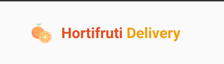

<h1 align="center">
     
</h1>

<h1 align="center">
     
</h1>

## 🏷️ Sobre 
**Hortifruti Delivery**: Aplicação para gerenciar um carrinho de compras de um Hortifruti fictícia.

O desafio proposto:
- [x] Listagem de produtos (Hortifruti) disponíveis para compra
- [x] Adicionar uma quantidade específicas de itens no carrinho
- [x] Aumentar ou remover a quantidade de itens no carrinho
- [x] Formulário para o usuário preencher o seu endereço
- [x] Exibir o total de itens no carrinho no Header 
- [x] Exibir o valor total da soma de itens no carrinho multiplicados pelo valor
- [x] Conecta a um API
## ⚠️OBS
### Adições além:
- [x] Salvar os dados no localStorage
- [x] Validação de formulário com react-hook-form e zod
- [x] Responsividade
- [x] Filtro de pesquisa


---

## 🛠️ Tecnologias e serviços utilizados
Foram utilizadas as seguintes tecnologias para desenvolver a aplicação **Coffee Delivery** :

- [HTML5](https://html.com/)
- [React.js](https://pt-br.reactjs.org/)
- [Typescript](https://www.typescriptlang.org/)
- [React-Query](https://www.react-query-v3.tanstack.com/)
- [styled-components](https://styled-components.com/)


---

## 🗂️ Como baixar e iniciar o projeto 

```bash

    #clonar o projeto
    $ git clone https://github.com/jaquelinepires/Hortifruti-Delivery.git

    #entrar no diretório
    $ cd Hortifruti-Delivery

    #instalar as dependências
    $ npm install

    #iniciar json-server
    $ npm start:server

    #iniciar a aplicação
    $ npm start
```
### Servidor local
localhost:3000

---

## 📝 Licença
Este projeto está sobe a [LICENÇA MIT](https://opensource.org/licenses/MIT)

---

### Desenvolvido 🤍  by Jaqueline Pires
